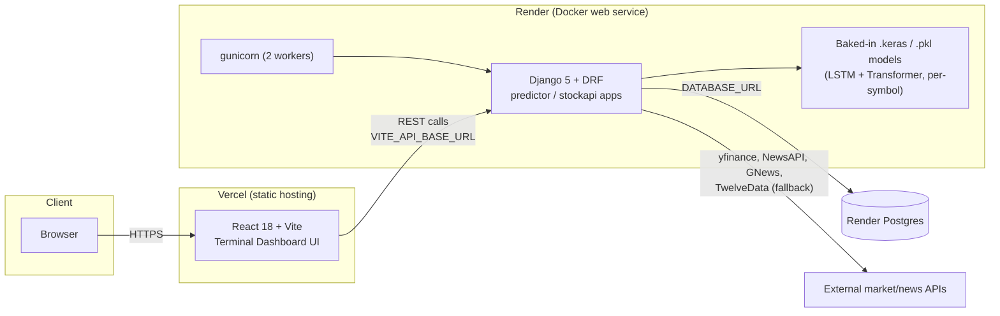

# Architecture

This document describes the production architecture of the Time-Series Modeling & Analytics System, and the reasoning behind the productionization decisions made when converting it from a local ML prototype into a deployed system.

## System overview

## Request flow: a prediction call

1. Browser loads the Vercel-hosted static bundle. `terminalApi.js` builds request URLs from `VITE_API_BASE_URL`, baked into the bundle at Vercel build time.
2. A request to `/predict/<symbol>/?model=transformer` hits the Render-hosted Django container.
3. `predictor.views` calls `get_prediction_system()`, which lazily loads and caches the relevant `.keras` model + `.pkl` scalers from `predictor/models/` on first use (see [Model loading](#model-loading-and-cold-starts)).
4. Feature data (OHLCV, technical indicators, sentiment) is read from Postgres / computed on the fly; the model produces a prediction, which is returned as JSON.
5. `/api/*` endpoints (market overview, technical indicators, sentiment) follow the same Django → Postgres/external-API path without touching the model layer.

## Why these production decisions

| Decision | Reasoning |
|---|---|
| Keep Django, don't migrate to FastAPI | The app was already a complete, working Django + DRF system. Migrating frameworks would touch the ML-serving code path for no functional benefit — out of scope for a pure productionization pass. |
| Bake models into the Docker image (`COPY`, not S3/volume) | ~220MB of models is small enough to ship in the image directly. This guarantees the exact same local models run in production with zero extra runtime dependencies (no object storage, no download-on-boot race). |
| `tensorflow-cpu` instead of `tensorflow` | Inference-only, no GPU in this deployment target; `tensorflow-cpu` drops bundled CUDA/cuDNN libraries, meaningfully shrinking the image. |
| Multi-stage Docker build | Keeps the pip download cache and build-time artifacts out of the final image layer. |
| Exclude `training_backups/` and `visualizations/` from the image | Confirmed via code search that no runtime code path reads these — they're training/eval-time artifacts only. Excluding them removes ~73MB with zero behavior change. |
| GitHub Actions owns all deploys (not Render/Vercel auto-deploy) | A staged pipeline (test → build → scan → deploy) is an auditable, portable CI/CD skill — the same pattern carries into this project's later AWS/GCP phases, whereas platform-native auto-deploy doesn't transfer anywhere. |
| Postgres over SQLite in production | Render's filesystem is ephemeral; SQLite would silently lose data on every redeploy. `DATABASE_URL`-based Postgres was already supported by `settings.py`, so this was a deploy-config choice, not a code change. |
| Env-driven settings (`SECRET_KEY`, `DEBUG`, `ALLOWED_HOSTS`, CORS) | Required to run the same codebase safely across local dev, CI, and production without hardcoded secrets or wide-open defaults. |

## Model loading and cold starts

Model loading in `predictor/dynamic_model.py` is lazy: the first call to `get_prediction_system()` loads and caches all `.keras`/`.pkl` artifacts into memory; every subsequent call reuses that cache. `/predict/health/` calls `get_prediction_system()`, so:

- Docker's own `HEALTHCHECK` and Render's `healthCheckPath` both prime the model cache as a side effect of checking health.
- The first real request after a cold start (deploy, or waking from Render free-tier idle) pays the model-load cost once; subsequent requests are fast.
- Each gunicorn worker loads its own copy of the models into memory — this is why worker count is deliberately kept at 2, not scaled up carelessly (see [Known limitations](../README.md#known-limitations)).

## Security posture

See the root [README](../README.md#security) for the full list of hardening measures (env-driven secrets, DRF throttling, HSTS/secure cookies in production, CI vulnerability/secret scanning). This document focuses on system shape; the README is the canonical list of what's enabled and why.
